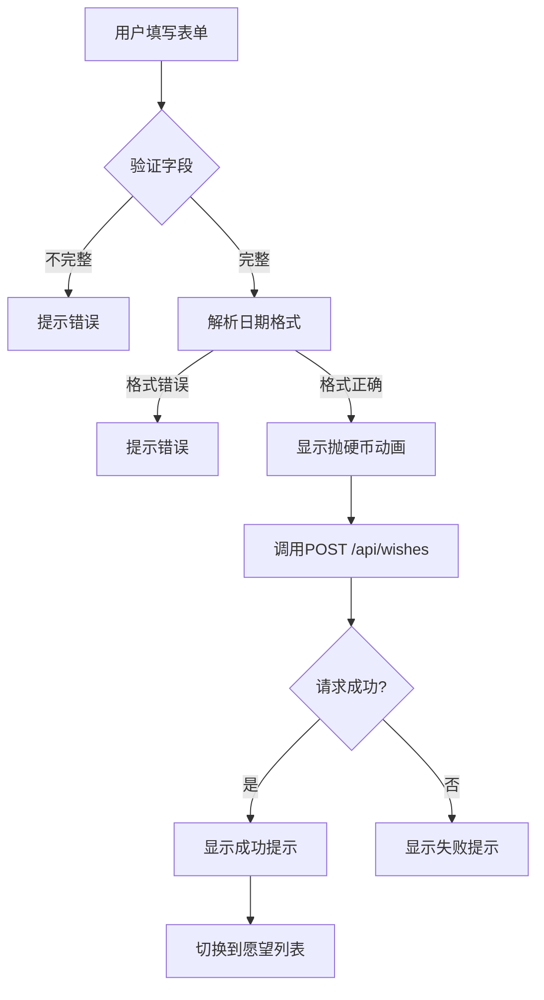
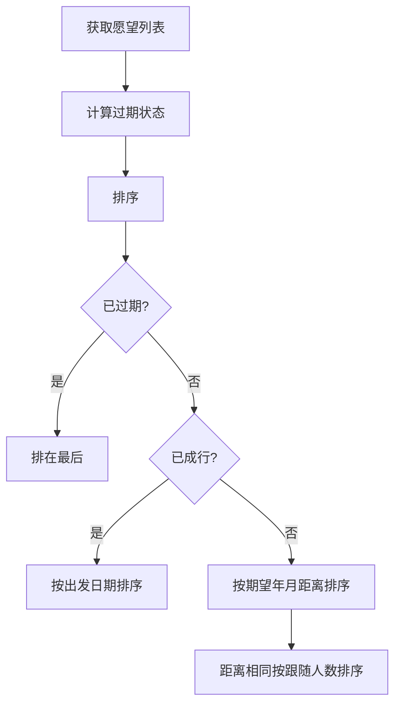
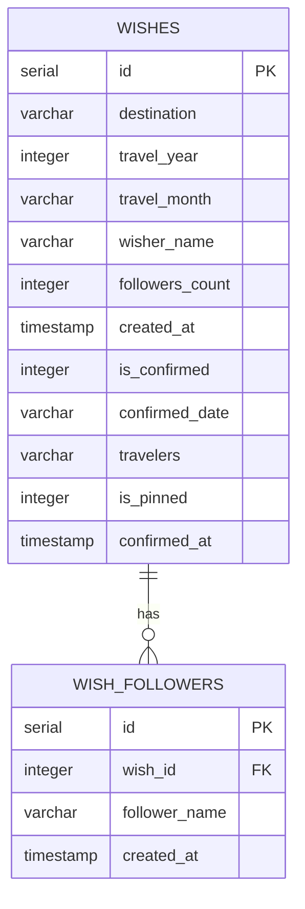

# 旅行许愿池 - Code Wiki

## 1. 项目概述

### 1.1 项目简介

**旅行许愿池**是一个基于 Next.js 16 + shadcn/ui 的全栈 Web 应用，允许用户创建旅行愿望、查看愿望列表、跟随他人的愿望，并支持管理员确认旅行成行状态。

### 1.2 核心功能

| 功能模块 | 描述 | 权限 |
|---------|------|------|
| 许愿功能 | 用户可以创建旅行愿望，填写目的地、期望出行年月和姓名 | 所有用户 |
| 愿望列表 | 展示所有愿望，支持排序和状态筛选 | 所有用户 |
| 跟随愿望 | 用户可以跟随感兴趣的愿望 | 所有用户 |
| 管理模式 | 管理员可以编辑、删除愿望，确认成行状态 | 管理员 |
| 年度时间轴 | 展示已成行旅行的年度时间轴视图 | 所有用户 |

### 1.3 技术栈

| 分类 | 技术 | 版本 |
|------|------|------|
| 框架 | Next.js | 16.1.1 |
| UI组件 | shadcn/ui | latest |
| 样式 | Tailwind CSS | v4 |
| 图标 | Lucide React | ^0.468.0 |
| 表单 | React Hook Form | ^7.70.0 |
| 表单验证 | Zod | ^4.3.5 |
| 数据库 | Supabase | 2.95.3 |
| ORM | Drizzle ORM | ^0.45.1 |
| 包管理器 | pnpm | 9+ |
| 语言 | TypeScript | 5.x |

---

## 2. 项目架构

### 2.1 整体架构

```
┌─────────────────────────────────────────────────────────────────────┐
│                        前端层 (Next.js)                              │
│  ┌───────────────────────────────────────────────────────────────┐  │
│  │  Pages: / (Home)                                             │  │
│  │    ├── 年度时间轴组件                                         │  │
│  │    ├── Tab切换 (抛硬币/许愿池)                                │  │
│  │    └── 愿望卡片列表                                          │  │
│  └───────────────────────────────────────────────────────────────┘  │
│                              ↓ API Calls                            │
├─────────────────────────────────────────────────────────────────────┤
│                        API层 (Next.js API Routes)                   │
│  ┌───────────────────────────────────────────────────────────────┐  │
│  │  /api/wishes          → CRUD操作愿望                          │  │
│  │  /api/wishes/[id]/confirm  → 确认成行                         │  │
│  │  /api/wishes/[id]/follow   → 跟随愿望                         │  │
│  │  /api/wishes/[id]/followers/[name] → 取消跟随                 │  │
│  └───────────────────────────────────────────────────────────────┘  │
│                              ↓ Database                            │
├─────────────────────────────────────────────────────────────────────┤
│                        数据层 (Supabase + Drizzle)                   │
│  ┌───────────────────────────────────────────────────────────────┐  │
│  │  wishes表      → 存储愿望信息                                  │  │
│  │  wish_followers表 → 存储跟随关系                              │  │
│  └───────────────────────────────────────────────────────────────┘  │
└─────────────────────────────────────────────────────────────────────┘
```

### 2.2 目录结构

```
src/
├── app/                      # Next.js App Router
│   ├── api/                  # API路由
│   │   └── wishes/           # 愿望相关API
│   │       ├── [id]/         # 动态路由（愿望ID）
│   │       │   ├── confirm/  # 确认成行
│   │       │   ├── follow/   # 跟随愿望
│   │       │   └── followers/[followerName]/  # 取消跟随
│   │       └── route.ts      # 愿望列表CRUD
│   ├── layout.tsx            # 根布局
│   ├── page.tsx              # 首页
│   ├── globals.css           # 全局样式
│   └── robots.ts             # SEO配置
├── components/
│   └── ui/                   # shadcn/ui组件库（39个组件）
├── hooks/
│   └── use-mobile.ts         # 移动端检测Hook
├── lib/
│   └── utils.ts              # 工具函数（cn函数）
└── storage/
    └── database/
        ├── shared/           # 数据库Schema和关系
        │   ├── schema.ts     # 表定义
        │   └── relations.ts  # 关系定义
        └── supabase-client.ts # Supabase客户端配置
```

---

## 3. 关键模块说明

### 3.1 数据库模块

#### 3.1.1 Schema定义

**wishes表** (`src/storage/database/shared/schema.ts`)

| 字段名 | 类型 | 约束 | 说明 |
|--------|------|------|------|
| id | serial | PRIMARY KEY | 主键ID |
| destination | varchar(255) | NOT NULL | 旅行目的地 |
| travel_year | integer | NOT NULL | 期望出行年份 |
| travel_month | varchar(20) | NOT NULL | 期望出行月份 |
| wisher_name | varchar(100) | NOT NULL | 许愿人姓名 |
| followers_count | integer | NOT NULL DEFAULT 0 | 跟随人数 |
| created_at | timestamp | NOT NULL DEFAULT NOW() | 创建时间 |
| is_confirmed | integer | NOT NULL DEFAULT 0 | 是否成行（0/1） |
| confirmed_date | varchar(20) | NULL | 具体出行日期 |
| travelers | varchar(500) | NULL | 出行人列表（逗号分隔） |
| is_pinned | integer | NOT NULL DEFAULT 0 | 是否置顶（0/1） |
| confirmed_at | timestamp | NULL | 确认成行时间 |

**wish_followers表** (`src/storage/database/shared/schema.ts`)

| 字段名 | 类型 | 约束 | 说明 |
|--------|------|------|------|
| id | serial | PRIMARY KEY | 主键ID |
| wish_id | integer | NOT NULL | 关联愿望ID |
| follower_name | varchar(100) | NOT NULL | 跟随人姓名 |
| created_at | timestamp | NOT NULL DEFAULT NOW() | 创建时间 |

#### 3.1.2 数据库客户端

**Supabase客户端** (`src/storage/database/supabase-client.ts`)

| 函数名 | 功能说明 | 参数 | 返回值 |
|--------|----------|------|--------|
| `loadEnv()` | 加载环境变量 | 无 | void |
| `getSupabaseCredentials()` | 获取Supabase凭据 | 无 | `{url, anonKey}` |
| `getSupabaseClient(token?)` | 创建Supabase客户端实例 | token?: string | SupabaseClient |

### 3.2 API模块

#### 3.2.1 愿望列表API (`src/app/api/wishes/route.ts`)

| 方法 | 路径 | 功能 |
|------|------|------|
| GET | `/api/wishes` | 获取所有愿望列表（包含跟随人信息和过期状态） |
| POST | `/api/wishes` | 创建新愿望 |

**GET请求响应结构**：
```typescript
{
  wishes: Wish[];
}
```

**POST请求参数**：
```typescript
{
  destination: string;    // 目的地
  travelYear: number;     // 出行年份
  travelMonth: string;    // 出行月份
  wisherName: string;     // 许愿人姓名
}
```

#### 3.2.2 愿望详情API (`src/app/api/wishes/[id]/route.ts`)

| 方法 | 路径 | 功能 |
|------|------|------|
| PUT | `/api/wishes/[id]` | 更新愿望信息 |
| DELETE | `/api/wishes/[id]` | 删除愿望（级联删除跟随记录） |

#### 3.2.3 确认成行API (`src/app/api/wishes/[id]/confirm/route.ts`)

| 方法 | 路径 | 功能 |
|------|------|------|
| POST | `/api/wishes/[id]/confirm` | 确认愿望成行 |
| PUT | `/api/wishes/[id]/confirm` | 更新已成行旅行信息 |

#### 3.2.4 跟随愿望API (`src/app/api/wishes/[id]/follow/route.ts`)

| 方法 | 路径 | 功能 |
|------|------|------|
| POST | `/api/wishes/[id]/follow` | 跟随愿望（幂等） |

#### 3.2.5 取消跟随API (`src/app/api/wishes/[id]/followers/[followerName]/route.ts`)

| 方法 | 路径 | 功能 |
|------|------|------|
| DELETE | `/api/wishes/[id]/followers/[followerName]` | 取消跟随 |

### 3.3 UI组件模块

#### 3.3.1 核心页面组件

**首页** (`src/app/page.tsx`)

| 组件功能 | 实现说明 |
|----------|----------|
| 年度时间轴 | 根据年份筛选已成行旅行，展示月份节点 |
| Tab切换 | 抛硬币（创建愿望）/ 许愿池（查看列表） |
| 愿望卡片 | 展示愿望详情、跟随人列表、操作按钮 |
| 管理模式 | 密码验证后启用编辑、删除、确认成行功能 |

#### 3.3.2 shadcn/ui组件清单

项目包含以下39个shadcn/ui基础组件：

| 类别 | 组件 |
|------|------|
| 表单 | button, input, textarea, select, checkbox, radio-group, switch, slider, field, form, input-otp |
| 布局 | card, separator, tabs, accordion, collapsible, scroll-area, aspect-ratio, resizable, sidebar |
| 反馈 | alert, alert-dialog, dialog, sonner, progress, spinner, empty |
| 导航 | dropdown-menu, menubar, navigation-menu, context-menu, pagination |
| 数据展示 | table, avatar, badge, hover-card, tooltip, popover |
| 其他 | calendar, command, carousel, toggle, toggle-group, chart, item, kbd |

### 3.4 工具函数模块

**utils.ts** (`src/lib/utils.ts`)

| 函数名 | 功能说明 | 参数 | 返回值 |
|--------|----------|------|--------|
| `cn(...inputs)` | 合并Tailwind CSS类名 | inputs: ClassValue[] | string |

### 3.5 自定义Hooks

**use-mobile.ts** (`src/hooks/use-mobile.ts`)

| Hook名 | 功能说明 | 返回值 |
|--------|----------|--------|
| `useIsMobile()` | 检测当前是否为移动端 | boolean |

---

## 4. 业务流程

### 4.1 许愿流程



### 4.2 跟随愿望流程

```mermaid
flowchart TD
    A[用户点击跟随按钮] --> B[弹出跟随对话框]
    B --> C[用户输入姓名]
    C --> D[调用POST /api/wishes/[id]/follow]
    D --> E{已跟随?}
    E -->|是| F[提示已跟随]
    E -->|否| G[插入跟随记录]
    G --> H[更新愿望跟随人数]
    H --> I[提示跟随成功]
    I --> J[刷新愿望列表]
```

### 4.3 确认成行流程

```mermaid
flowchart TD
    A[管理员进入管理模式] --> B[选择未确认愿望]
    B --> C[点击确定成行按钮]
    C --> D[弹出确认对话框]
    D --> E[填写出发日期和出行人]
    E --> F[调用POST /api/wishes/[id]/confirm]
    F --> G[更新is_confirmed=1]
    G --> H[设置confirmed_date和travelers]
    H --> I[设置is_pinned=1]
    I --> J[提示确认成功]
```

### 4.4 愿望排序规则



---

## 5. 数据模型

### 5.1 Wish接口

```typescript
interface Wish {
  id: number;                      // 愿望ID
  destination: string;             // 目的地
  travel_year: number;             // 期望出行年份
  travel_month: string;            // 期望出行月份
  wisher_name: string;             // 许愿人姓名
  followers_count: number;         // 跟随人数
  created_at: string;              // 创建时间
  followers: string[];             // 跟随人列表（扩展字段）
  is_confirmed: number;            // 是否成行（0/1）
  confirmed_date?: string;         // 具体出行日期
  travelers?: string;              // 出行人列表
  is_pinned: number;               // 是否置顶（0/1）
  confirmed_at?: string;           // 确认成行时间
  is_expired?: number;             // 是否已过期（0/1，扩展字段）
}
```

### 5.2 数据库ER图



---

## 6. 依赖关系

### 6.1 核心依赖

| 依赖 | 用途 |
|------|------|
| `next` | Next.js框架 |
| `@supabase/supabase-js` | Supabase数据库客户端 |
| `drizzle-orm` | ORM工具 |
| `drizzle-kit` | Drizzle CLI工具 |
| `react-hook-form` | 表单处理 |
| `zod` | 表单验证 |
| `@hookform/resolvers` | React Hook Form解析器 |
| `@radix-ui/react-*` | Radix UI基础组件 |
| `class-variance-authority` | 组件样式变体 |
| `clsx` | 类名合并 |
| `tailwind-merge` | Tailwind类名合并 |
| `lucide-react` | 图标库 |
| `next-themes` | 主题切换 |

### 6.2 开发依赖

| 依赖 | 用途 |
|------|------|
| `tailwindcss` | Tailwind CSS |
| `@tailwindcss/postcss` | Tailwind PostCSS插件 |
| `typescript` | TypeScript |
| `eslint` | 代码检查 |
| `eslint-config-next` | Next.js ESLint配置 |
| `shadcn` | shadcn/ui CLI |
| `react-dev-inspector` | 开发调试工具 |

---

## 7. 运行与部署

### 7.1 环境要求

- **Node.js**: >= 20.x
- **pnpm**: >= 9.0.0

### 7.2 开发命令

```bash
# 安装依赖
pnpm install

# 启动开发服务器
pnpm dev

# 构建生产版本
pnpm build

# 启动生产服务器
pnpm start

# 类型检查
pnpm ts-check

# 代码检查
pnpm lint
```

### 7.3 环境变量

项目需要以下环境变量（通过Supabase配置）：

| 变量名 | 说明 |
|--------|------|
| `COZE_SUPABASE_URL` | Supabase数据库URL |
| `COZE_SUPABASE_ANON_KEY` | Supabase匿名访问密钥 |

### 7.4 配置说明

- **tsconfig.json**: 配置了路径别名 `@/*` → `./src/*`
- **next.config.ts**: Next.js配置（未在文件列表中显示）
- **postcss.config.mjs**: Tailwind CSS v4配置
- **components.json**: shadcn/ui组件配置

---

## 8. 代码规范

### 8.1 组件开发规范

1. **优先使用shadcn/ui组件**：从 `@/components/ui/` 导入基础组件
2. **使用工具函数**：使用 `cn()` 函数合并类名
3. **类型安全**：使用TypeScript定义Props类型
4. **客户端组件**：需要交互的组件添加 `'use client'` 指令

### 8.2 路由开发规范

1. **文件系统路由**：在 `src/app/` 目录下创建文件夹和 `page.tsx`
2. **API路由**：在 `src/app/api/` 目录下创建
3. **服务端组件**：默认使用服务端组件，需要客户端交互时添加 `'use client'`

### 8.3 依赖管理规范

1. **必须使用pnpm**：项目配置了 `preinstall` 脚本禁止其他包管理器
2. **添加依赖**：`pnpm add package-name`
3. **添加开发依赖**：`pnpm add -D package-name`

---

## 9. 安全注意事项

### 9.1 管理员权限

- 管理员密码硬编码在前端代码中（`tobi7758258`）
- 建议在生产环境中使用更安全的认证方式

### 9.2 输入验证

- API端点均有输入验证
- 使用Zod进行表单验证
- 日期格式验证

### 9.3 SQL注入防护

- 使用Supabase参数化查询，防止SQL注入
- ORM层自动处理参数绑定

---

## 10. 扩展建议

### 10.1 功能扩展

1. **用户认证系统**：添加用户注册/登录功能
2. **愿望分类**：支持按目的地类型分类
3. **通知系统**：愿望状态变更通知
4. **图片上传**：支持上传旅行照片
5. **分享功能**：支持分享愿望到社交平台

### 10.2 性能优化

1. **数据缓存**：使用Redis缓存热门愿望
2. **分页加载**：支持愿望列表分页
3. **图片优化**：使用WebP格式，支持懒加载

### 10.3 安全增强

1. **JWT认证**：替换简单密码验证
2. **RBAC权限**：细粒度权限控制
3. **HTTPS强制**：生产环境强制HTTPS

---

## 附录：文件路径速查

| 文件 | 路径 |
|------|------|
| 首页组件 | `src/app/page.tsx` |
| 根布局 | `src/app/layout.tsx` |
| 全局样式 | `src/app/globals.css` |
| 愿望列表API | `src/app/api/wishes/route.ts` |
| 愿望详情API | `src/app/api/wishes/[id]/route.ts` |
| 确认成行API | `src/app/api/wishes/[id]/confirm/route.ts` |
| 跟随愿望API | `src/app/api/wishes/[id]/follow/route.ts` |
| 取消跟随API | `src/app/api/wishes/[id]/followers/[followerName]/route.ts` |
| 数据库Schema | `src/storage/database/shared/schema.ts` |
| Supabase客户端 | `src/storage/database/supabase-client.ts` |
| 工具函数 | `src/lib/utils.ts` |
| 移动端Hook | `src/hooks/use-mobile.ts` |
| UI组件目录 | `src/components/ui/` |
| 配置文件 | `package.json`, `tsconfig.json`, `components.json` |